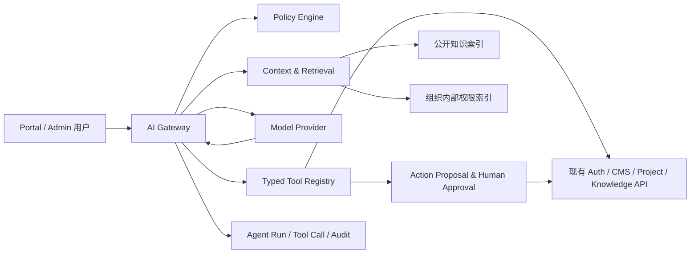

# QUTCraft Commons × AI 智能体集成设计

> 状态：架构提案，尚未实现  
> 目标版本：`v0.1.0-competition`（核心 CMS 通过 G5 后实施）  
> 更新日期：2026-07-28  
> 前置条件：RBAC、审计、内容状态机、知识可见性和 API 契约通过 G5

## 1. 结论

QUTCraft Commons 与 AI 最合适的结合方式不是“在每个页面塞一个聊天框”，而是增加一个独立的、服务端受控的 **组织运营智能体层**。

这个智能体层应具备三种能力：

1. **理解组织资料**：在当前用户权限范围内检索内容、知识库、项目和公开数据。
2. **辅助生产与分析**：生成 Markdown 草稿、摘要、标签、周报和风险提示。
3. **提出可审查动作**：通过类型化工具创建草稿或变更提案，由人确认后才进入现有业务状态机。

AI 不成为权限系统、审批系统或 ServerAdapter 的替代品。它是现有 CMS 的受限调用者。

## 2. 产品定位

建议把 AI 能力命名为“组织运营智能体”或“Commons Agent”，避免将项目包装成泛化聊天机器人。

对通用校园社团，它可以：

- 把活动记录整理成新闻草稿；
- 从知识库回答新成员问题，并给出引用；
- 汇总项目、里程碑和内容发布情况；
- 发现缺少负责人、长期未更新或即将到期的事项；
- 将零散资料转换为规范化 Markdown；
- 为门户内容生成摘要、标签、SEO 描述和图片替代文本。

对 QUTCraft，它还可以：

- 根据活动记录生成服务器活动公告草稿；
- 从 Wiki、规则和项目文档回答 Minecraft 社团问题；
- 汇总建筑项目、资源包、服务器维护记录；
- 辅助审核员整理白名单申请信息，但不代替审核员作决定。

## 3. 第一批应该做什么

### A1 · 内容协作智能体

输入：

- 用户自然语言要求；
- 用户明确选择的现有内容；
- 允许访问的知识条目；
- 组织写作规范。

输出：

- 标准 Markdown；
- 标题、摘要、分类和标签建议；
- 引用来源；
- `content.create_draft` 或 `content.update_draft` 工具提案。

边界：

- 只能创建或修改草稿；
- 不能发布、下线或删除内容；
- 用户必须看到差异并确认保存；
- AI 生成内容必须标记生成来源和模型版本。

这是最适合作为首个功能的方向，因为当前 CMS 已有 Markdown 编辑器、内容 DTO、草稿状态机和媒体引用能力。

### A2 · 权限感知知识助手

公开门户助手：

- 只检索已发布 Portal 数据；
- 可回答组织介绍、公开项目、资源和 Wiki 问题；
- 每个结论必须给出可点击来源；
- 不知道时明确回答“不确定”，不能编造内部状态。

内部知识助手：

- 需要登录；
- 检索结果先经过组织与权限过滤；
- 可使用内部知识、被授权项目和内容草稿；
- 不返回成员邮箱、申请材料、审计记录等不必要隐私。

公开索引和内部索引必须物理或逻辑分离，不能只依靠提示词要求模型“不要泄露”。

### A3 · 组织周报与项目观察员

读取：

- 最近发布/修改的内容；
- 项目状态与里程碑；
- 待处理申请数量；
- 知识库新增情况；
- 同步失败数量。

生成：

- 周报草稿；
- 未完成事项；
- 风险与异常提示；
- 建议负责人下一步检查的项目。

第一版只读，不自动修改项目、不自动催促成员、不自动发送外部消息。

## 4. 暂时不做什么

下列能力不进入第一阶段：

- AI 自动发布或下线内容；
- AI 自动批准/拒绝成员或白名单申请；
- AI 自动修改角色、成员状态或 Owner；
- AI 自动删除内容、文件、知识目录或项目；
- AI 直接执行 RCON、白名单写入或任意服务器命令；
- AI 在无人确认时向外部邮箱、群聊或 Webhook 发消息；
- AI 自主安装插件、运行任意脚本或查询数据库；
- 向模型暴露密码、Token、数据库连接、对象存储密钥或服务器凭据。

真实 RCON 当前已暂缓。即使未来启用，也不应把 `server:command` 工具授予 AI。

## 5. 总体架构



### 5.1 AI Gateway

负责：

- 创建智能体会话和运行；
- 选择模型供应商；
- 拼装系统策略和受限上下文；
- 限制 Token、时间、工具调用次数和费用；
- 校验模型输出；
- 保存运行状态和审计摘要；
- 向前端推送流式文本和工具提案。

模型 SDK 不应散落在 Handler、页面或各业务 Service 中。

### 5.2 ModelProvider

使用供应商无关接口：

```text
Generate(ctx, Request) -> Response
Stream(ctx, Request) -> EventStream
Embed(ctx, Text[]) -> Vector[]
```

实现可以是云模型、本地模型或比赛演示 Mock。业务层不得依赖某一家供应商的专有消息格式。

### 5.3 Context & Retrieval

检索流程必须先授权、后召回：

```text
用户身份
  → organization_id
  → RBAC / 资源范围
  → 允许检索的数据集合
  → 向量/关键词混合检索
  → 返回最少必要片段
```

禁止先从全库召回，再让模型自行忽略无权限内容。

### 5.4 Typed Tool Registry

AI 不直接调用数据库，也不把自然语言拼成内部 URL。每个工具使用固定 JSON Schema：

```json
{
  "name": "content.create_draft",
  "description": "在当前组织创建内容草稿",
  "required_permission": "content:create",
  "risk": "write_low",
  "input_schema": {
    "type": "object",
    "required": ["title", "type", "body"],
    "properties": {
      "title": { "type": "string", "maxLength": 160 },
      "type": { "enum": ["news", "resource", "knowledge"] },
      "body": { "type": "string" }
    }
  }
}
```

工具最终仍调用现有 Service/领域规则，不能绕过内容状态机、组织隔离和审计。

## 6. 权限模型

一次工具调用的有效权限是四个集合的交集：

```text
当前用户权限
∩ 智能体定义允许的工具
∩ 当前运行策略
∩ 人工批准范围
```

即使模型要求调用某工具，只要其中任一层不允许，服务端必须拒绝。

### 6.1 工具风险级别

| 等级 | 示例 | 第一阶段策略 |
| --- | --- | --- |
| `read_public` | 公开动态、项目、知识检索 | 可自动调用。 |
| `read_internal` | 内部知识、授权项目 | 登录、RBAC、审计后可调用。 |
| `write_draft` | 创建内容草稿、生成周报草稿 | 显示提案，用户确认后调用。 |
| `write_sensitive` | 发布、审批、角色修改、删除 | 第一阶段禁止。 |
| `external_high_risk` | RCON、邮件群发、Webhook | 第一阶段禁止。 |

### 6.2 永久禁止作为普通 AI 工具的能力

- 签发或刷新身份 Token；
- 读取密码、密钥和环境变量；
- 修改 Owner；
- 绕过内容发布权限；
- 任意 SQL、Shell、文件系统和网络访问；
- 任意 RCON 字符串执行。

## 7. 智能体运行状态

建议领域对象：

### AgentDefinition

- `id`
- `organization_id`
- `name`
- `purpose`
- `system_policy_version`
- `allowed_tool_keys`
- `model_profile`
- `enabled`

### AgentRun

- `id`
- `organization_id`
- `actor_user_id`
- `agent_definition_id`
- `status`
- `input_summary`
- `output_summary`
- `model`
- `prompt_version`
- `token_usage`
- `cost_estimate`
- `started_at`
- `completed_at`
- `expires_at`

状态：

```text
queued → running → waiting_approval → running → succeeded
                 └──────────────────────────────→ failed
queued/running/waiting_approval ───────────────→ canceled
```

### AgentToolCall

- `run_id`
- `tool_key`
- `risk`
- `arguments_redacted`
- `status`
- `required_permission`
- `approved_by`
- `request_id`
- `result_summary`

### AgentApproval

- `tool_call_id`
- `status`: `pending`、`approved`、`rejected`、`expired`
- `requested_by_run`
- `decided_by`
- `decided_at`
- `expires_at`

不保存模型隐藏推理过程。只保存用户输入、必要上下文引用、工具参数、输出、决策摘要和审计信息。

## 8. API 草案

以下是规划接口，不进入当前 OpenAPI，直到对应 Go 路由实现：

| 方法 | 路径 | 说明 |
| --- | --- | --- |
| `GET` | `/api/v1/admin/ai/agents` | 获取当前组织可用智能体。 |
| `POST` | `/api/v1/admin/ai/runs` | 创建一次智能体运行。 |
| `GET` | `/api/v1/admin/ai/runs/{run_id}` | 查询状态、引用、输出和工具提案。 |
| `POST` | `/api/v1/admin/ai/runs/{run_id}/cancel` | 取消未结束运行。 |
| `POST` | `/api/v1/admin/ai/tool-calls/{tool_call_id}/approve` | 批准一次具体工具调用。 |
| `POST` | `/api/v1/admin/ai/tool-calls/{tool_call_id}/reject` | 拒绝工具调用。 |
| `POST` | `/api/v1/admin/ai/knowledge/search` | 权限感知的内部知识检索。 |
| `POST` | `/api/v1/portal/organizations/{slug}/assistant/query` | 后续可选的公开知识问答。 |

建议创建运行的请求：

```json
{
  "agent_key": "content-copilot",
  "task": "根据暑期建筑活动记录生成一篇门户动态草稿",
  "context_refs": [
    {
      "type": "content",
      "id": "content-id"
    }
  ],
  "output_mode": "proposal"
}
```

响应不应假装同步完成：

```json
{
  "data": {
    "id": "run-id",
    "status": "queued",
    "stream_url": "/api/v1/admin/ai/runs/run-id/events"
  },
  "meta": {
    "request_id": "request-id"
  }
}
```

## 9. Prompt Injection 与数据安全

知识库、网页、上传文档和用户输入都视为不可信数据。

必须做到：

1. 检索内容只作为引用数据，不能覆盖系统策略。
2. 工具调用由服务端 Schema 和权限校验决定，不能相信模型生成的权限声明。
3. URL 获取使用域名白名单、大小限制、内容类型限制和 SSRF 防护。
4. 上传文档先病毒检查、文本抽取和安全分块，不执行宏、脚本或嵌入代码。
5. 模型输出按不可信 Markdown/HTML 清洗后展示。
6. 内部与公开索引分离，并在每个向量条目保存 `organization_id`、可见性和来源版本。
7. 发送给外部模型前最小化个人信息；邮箱、QQ、申请材料默认不进入模型上下文。
8. 日志不得保存 API Key、完整 Token、模型供应商凭据或未脱敏工具结果。

## 10. 审计和可观测性

每次运行至少记录：

- 操作者、组织和智能体定义；
- 模型与 Prompt 版本；
- 使用的数据来源 ID 和版本；
- 工具调用及权限判定；
- 人工批准人；
- Token 使用量、耗时和失败类型；
- `request_id` 与运行 ID。

质量指标：

- 引用命中率；
- 无依据回答率；
- 工具参数校验失败率；
- 人工批准/拒绝比例；
- 草稿被采用和修改的比例；
- 单次运行费用与 P95 延迟；
- 越权与 Prompt Injection 测试通过率。

## 11. 部署建议

初期仍可部署在同一服务器，但拆成独立进程：

```text
Web
API
Agent Worker
MySQL
Redis
Object Storage
```

- API 负责鉴权、创建运行和批准工具。
- Agent Worker 负责模型调用、检索和长任务。
- Redis 可先承担短任务队列；稳定后再评估专用消息系统。
- 模型 API Key 只注入 Agent Worker。
- Agent Worker 不持有数据库超级权限，不开放公网入口。

## 12. 分阶段路线

### AI-0 · 规范与 Mock

- 定义 `ModelProvider`、AgentRun、Tool Schema 和审计模型；
- 创建可重复 Mock Provider；
- 只提供 `read_public` 和 Markdown 生成演示；
- 建立 Prompt Injection 和权限测试集。

### AI-1 · 内容协作

- 内容编辑器增加“AI 生成草稿/摘要/标签”；
- 支持引用选定知识条目；
- 所有写入停留在草稿；
- 保存差异和人工确认记录。

### AI-2 · 知识问答

- 建立公开与内部索引；
- 混合检索与引用；
- Admin 内部知识助手；
- 可选公开 Portal 助手，增加限流和滥用防护。

### AI-3 · 组织观察员

- 项目/里程碑/内容周报；
- 风险提示；
- 定时生成草稿，但不自动发送或执行；
- 成本预算和运行配额。

### AI-4 · 受控工作流

- 增加低风险工具提案；
- 人工批准；
- 幂等执行、失败重试和补偿；
- 仍不开放 RCON、角色修改、审批决定和自动发布。

## 13. MVP 建议

如果需要尽快形成比赛展示，优先做一个窄而完整的闭环：

```text
用户选择知识资料
→ 要求生成社团动态
→ AI 返回带引用的 Markdown
→ 用户查看差异
→ 创建 CMS 草稿
→ 人工编辑
→ 现有发布权限完成发布
→ Portal 展示
```

这个闭环能证明：

- AI 与 CMS 数据真实连接；
- 知识检索有来源；
- AI 不绕过权限；
- 人仍掌握最终发布权；
- 同一能力适用于 Minecraft 社团和普通校园组织。

它比“AI 能聊天”更符合项目的产品逻辑，也更容易在比赛中清楚演示。
